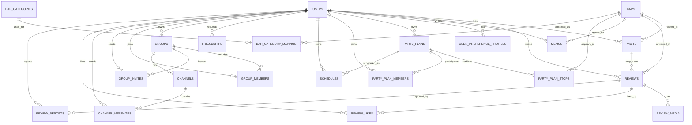

## 0. 공통 컬럼 베이스

대부분 “주요 엔티티 테이블”에 공통으로 들어갈 컬럼들:

|컬럼명|타입|NOT NULL|설명|
|---|---|---|---|
|id|BIGINT PK|Y|기본 키|
|created_at|DATETIME|Y|생성 시각|
|updated_at|DATETIME|Y|마지막 수정 시각|
|deleted_at|DATETIME|N|삭제(비활성) 시각(soft delete)|
|created_by_id|BIGINT FK|N|생성자 user id (users.id)|
|updated_by_id|BIGINT FK|N|수정자 user id (users.id)|

아래 표들에서 **이 공통 컬럼은 생략**하고, 도메인 고유 컬럼만 적을게.

---

## 1. 사용자 / 친구 / 방문 / 선호도

### 1-1. USERS (회원)

|컬럼명|타입|NOT NULL|설명|
|---|---|---|---|
|login_id|VARCHAR|Y|로그인 아이디|
|password_hash|VARCHAR|Y|비밀번호 해시|
|name|VARCHAR|Y|이름|
|phone|VARCHAR|N|전화번호|
|email|VARCHAR|N|이메일|
|birth_date|DATE|N|생년월일|
|address|VARCHAR/TEXT|N|주소(거주지 정도)|
|gender|VARCHAR(10)|N|성별|
|profile_image_url|VARCHAR|N|프로필 이미지 URL|
|status|VARCHAR(20)|Y|ACTIVE/WITHDRAWN/BANNED|
|last_login_at|DATETIME|N|마지막 로그인 시각|

---

### 1-2. OAUTH_ACCOUNTS (구글 로그인 연동 등)

|컬럼명|타입|NOT NULL|설명|
|---|---|---|---|
|user_id|BIGINT FK|Y|연결된 사용자 (users.id)|
|provider|VARCHAR(20)|Y|제공자(GOOGLE 등)|
|provider_user_id|VARCHAR|Y|제공자 쪽 유저 ID|
|access_token|TEXT|N|액세스 토큰(선택)|
|refresh_token|TEXT|N|리프레시 토큰(선택)|

---

### 1-3. FRIENDSHIPS (친구 관계)

|컬럼명|타입|NOT NULL|설명|
|---|---|---|---|
|requester_id|BIGINT FK|Y|친구 요청 보낸 유저 (users.id)|
|addressee_id|BIGINT FK|Y|친구 요청 받은 유저 (users.id)|
|status|VARCHAR(20)|Y|PENDING/ACCEPTED/REJECTED/BLOCKED|

---

### 1-4. VISITS (방문 이력)

|컬럼명|타입|NOT NULL|설명|
|---|---|---|---|
|user_id|BIGINT FK|Y|방문한 유저 (users.id)|
|bar_id|BIGINT FK|Y|방문한 술집 (bars.id)|
|visited_at|DATETIME|Y|방문 시각|
|people_count|INT|N|함께 간 인원 수|
|phase|INT|N|1,2,3… (1차/2차/3차 등 단계)|
|visibility|VARCHAR(20)|Y|PUBLIC/FRIENDS/PRIVATE (공개 범위)|

---

### 1-5. USER_PREFERENCE_PROFILES (선호도 프로파일)

|컬럼명|타입|NOT NULL|설명|
|---|---|---|---|
|user_id|BIGINT FK|Y|대상 유저 (users.id)|
|preferred_categories|TEXT/JSON|N|선호 카테고리(이자카야, 와인바 등)|
|preferred_price_range|VARCHAR(20)|N|선호 가격대 (LOW/MID/HIGH 등)|
|profile_json|TEXT/JSON|N|전체 선호도/모델 피쳐를 묶어둔 JSON|

---

## 2. 술집 / 카테고리 / 지도

### 2-1. BARS (술집)

|컬럼명|타입|NOT NULL|설명|
|---|---|---|---|
|name|VARCHAR|Y|가게 이름|
|address|VARCHAR/TEXT|Y|지번 주소|
|road_address|VARCHAR/TEXT|N|도로명 주소|
|latitude|DOUBLE|Y|위도|
|longitude|DOUBLE|Y|경도|
|phone_number|VARCHAR|N|전화번호|
|description|TEXT|N|가게 설명/소개|
|main_category_id|BIGINT FK|N|대표 카테고리 (bar_categories.id)|
|avg_rating|DECIMAL(2,1)|N|평균 별점 캐시|
|review_count|INT|N|리뷰 개수 캐시|
|is_open|BOOLEAN|N|현재 영업 중 여부|
|status_checked_at|DATETIME|N|영업 상태 마지막 확인 시각|

---

### 2-2. BAR_CATEGORIES

|컬럼명|타입|NOT NULL|설명|
|---|---|---|---|
|name|VARCHAR|Y|카테고리명(이자카야, 와인바 등)|

### 2-3. BAR_CATEGORY_MAPPING (다대다 매핑)

|컬럼명|타입|NOT NULL|설명|
|---|---|---|---|
|bar_id|BIGINT FK|Y|술집 (bars.id)|
|category_id|BIGINT FK|Y|카테고리 (bar_categories.id)|

> PK는 `(bar_id, category_id)` 복합키로 잡으면 됨.

---

## 3. 리뷰 / 미디어 / 좋아요 / 신고 / 메모

### 3-1. REVIEWS

|컬럼명|타입|NOT NULL|설명|
|---|---|---|---|
|user_id|BIGINT FK|Y|작성자 (users.id)|
|bar_id|BIGINT FK|Y|대상 술집 (bars.id)|
|visit_id|BIGINT FK|N|연결된 방문 기록 (visits.id)|
|rating|INT|Y|별점 (1~5 등)|
|content|TEXT|Y|리뷰 내용|
|like_count|INT|N|좋아요 수 캐시|

---

### 3-2. REVIEW_MEDIA (리뷰 사진/영상)

|컬럼명|타입|NOT NULL|설명|
|---|---|---|---|
|review_id|BIGINT FK|Y|리뷰 (reviews.id)|
|media_type|VARCHAR(10)|Y|IMAGE / VIDEO|
|url|VARCHAR/TEXT|Y|미디어 파일 URL|
|order_index|INT|N|같은 리뷰 내에서의 순서|

---

### 3-3. REVIEW_LIKES (리뷰 좋아요)

|컬럼명|타입|NOT NULL|설명|
|---|---|---|---|
|review_id|BIGINT FK|Y|대상 리뷰 (reviews.id)|
|user_id|BIGINT FK|Y|좋아요 누른 유저 (users.id)|
|created_at|DATETIME|Y|좋아요 누른 시각|

> `(review_id, user_id)`를 UNIQUE로 두면 중복 좋아요 방지.

---

### 3-4. REVIEW_REPORTS (리뷰 신고)

|컬럼명|타입|NOT NULL|설명|
|---|---|---|---|
|review_id|BIGINT FK|Y|신고 대상 리뷰 (reviews.id)|
|reporter_id|BIGINT FK|Y|신고한 유저 (users.id)|
|reason|TEXT|Y|신고 사유|
|status|VARCHAR(20)|Y|PENDING/ACCEPTED/REJECTED|

---

### 3-5. MEMOS (개인 메모)

|컬럼명|타입|NOT NULL|설명|
|---|---|---|---|
|user_id|BIGINT FK|Y|메모 작성자 (users.id)|
|bar_id|BIGINT FK|Y|관련 술집 (bars.id)|
|content|TEXT|Y|메모 내용 (나만 보기)|

---

## 4. 플랜(코스) / 일정 / 캘린더

### 4-1. PARTY_PLANS (플랜)

|컬럼명|타입|NOT NULL|설명|
|---|---|---|---|
|owner_id|BIGINT FK|Y|플랜 생성자 (users.id)|
|title|VARCHAR|Y|플랜 이름|
|description|TEXT|N|플랜 설명|
|status|VARCHAR(20)|Y|PLANNED/DONE/CANCELLED 등|

---

### 4-2. PARTY_PLAN_STOPS (플랜 내 코스/장소)

|컬럼명|타입|NOT NULL|설명|
|---|---|---|---|
|plan_id|BIGINT FK|Y|플랜 (party_plans.id)|
|bar_id|BIGINT FK|Y|들를 술집 (bars.id)|
|sequence|INT|Y|순서 (1차/2차/3차…)|
|expected_time|DATETIME|N|예상 도착 시간|
|route_info|TEXT/JSON|N|이동 경로 정보(요약 텍스트 or JSON)|
|memo|TEXT|N|해당 장소 메모(예약 정보 등)|

---

### 4-3. PARTY_PLAN_MEMBERS (플랜 참여자)

|컬럼명|타입|NOT NULL|설명|
|---|---|---|---|
|plan_id|BIGINT FK|Y|플랜 (party_plans.id)|
|user_id|BIGINT FK|Y|참여자 (users.id)|
|role|VARCHAR(20)|Y|HOST/GUEST 등|

> PK는 `(plan_id, user_id)` 복합키로 두는 걸 추천.

---

### 4-4. PLAN_VOTES (플랜 투표) – 선택적이지만 포함

|컬럼명|타입|NOT NULL|설명|
|---|---|---|---|
|plan_id|BIGINT FK|Y|플랜 (party_plans.id)|
|user_id|BIGINT FK|Y|투표한 유저 (users.id)|
|vote|INT or VARCHAR|Y|선호도(좋아요/점수 등)|
|created_at|DATETIME|Y|투표 시각|

---

### 4-5. SCHEDULES (술자리 일정)

|컬럼명|타입|NOT NULL|설명|
|---|---|---|---|
|owner_id|BIGINT FK|Y|일정 생성자 (users.id)|
|plan_id|BIGINT FK|N|연결된 플랜 (party_plans.id)|
|bar_id|BIGINT FK|N|단일 장소 일정일 때 술집 (bars.id)|
|start_at|DATETIME|Y|시작 시각|
|end_at|DATETIME|N|종료 시각|
|title|VARCHAR|Y|캘린더에 보일 제목(한 줄 요약)|
|meeting_type|VARCHAR(20)|N|회식/친구모임/데이트 등 분류|
|notify_at|DATETIME|N|알림 시각(간단 버전)|

---

### 4-6. SCHEDULE_NOTIFICATIONS (옵션: 여러 알림시점)

|컬럼명|타입|NOT NULL|설명|
|---|---|---|---|
|schedule_id|BIGINT FK|Y|일정 (schedules.id)|
|minutes_before|INT|Y|몇 분 전에 알림할지 (30, 60 등)|

---

### 4-7. CALENDARS (옵션: 캘린더 개념)

|컬럼명|타입|NOT NULL|설명|
|---|---|---|---|
|owner_id|BIGINT FK|Y|캘린더 소유자 (users.id)|
|name|VARCHAR|Y|캘린더 이름|
|type|VARCHAR(20)|Y|PERSONAL/SHARED|
|external_type|VARCHAR(20)|N|GOOGLE 등 외부 캘린더 타입|
|external_id|VARCHAR|N|외부 캘린더 식별자|

### 4-8. CALENDAR_SHARES (옵션: 공유 설정)

|컬럼명|타입|NOT NULL|설명|
|---|---|---|---|
|calendar_id|BIGINT FK|Y|캘린더 (calendars.id)|
|user_id|BIGINT FK|Y|공유 대상 유저 (users.id)|
|permission|VARCHAR(20)|Y|VIEW/EDIT|

> PK `(calendar_id, user_id)` 권장.

---

## 5. 소셜(그룹/채널/채팅) – 최소 구조

### 5-1. GROUPS

|컬럼명|타입|NOT NULL|설명|
|---|---|---|---|
|name|VARCHAR|Y|그룹 이름|
|owner_id|BIGINT FK|Y|그룹 생성자 (users.id)|
|description|TEXT|N|그룹 설명|
|status|VARCHAR(20)|Y|ACTIVE/CLOSED 등|

### 5-2. GROUP_MEMBERS

|컬럼명|타입|NOT NULL|설명|
|---|---|---|---|
|group_id|BIGINT FK|Y|그룹 (groups.id)|
|user_id|BIGINT FK|Y|멤버 (users.id)|
|role|VARCHAR(20)|Y|OWNER/ADMIN/MEMBER|
|joined_at|DATETIME|Y|가입 시각|

> PK `(group_id, user_id)`.

### 5-3. GROUP_INVITES

|컬럼명|타입|NOT NULL|설명|
|---|---|---|---|
|group_id|BIGINT FK|Y|그룹 (groups.id)|
|inviter_id|BIGINT FK|Y|초대한 사람 (users.id)|
|invite_code|VARCHAR|Y|초대 URL 토큰|
|expires_at|DATETIME|N|만료 시각|
|max_uses|INT|N|최대 사용 횟수|
|used_count|INT|N|실제 사용 횟수|

---

### 5-4. CHANNELS

|컬럼명|타입|NOT NULL|설명|
|---|---|---|---|
|group_id|BIGINT FK|Y|소속 그룹 (groups.id)|
|name|VARCHAR|Y|채널 이름|
|type|VARCHAR(20)|Y|GENERAL/PLAN/EVENT 등|
|party_plan_id|BIGINT FK|N|특정 플랜용 채널일 경우 (party_plans.id)|
|schedule_id|BIGINT FK|N|특정 일정 채널일 경우 (schedules.id)|
|is_default|BOOLEAN|N|그룹 생성 시 기본 채널 여부|

---

### 5-5. CHANNEL_MESSAGES

|컬럼명|타입|NOT NULL|설명|
|---|---|---|---|
|channel_id|BIGINT FK|Y|채널 (channels.id)|
|sender_id|BIGINT FK|Y|보낸 사람 (users.id)|
|content|TEXT|Y|메시지 내용|
|sent_at|DATETIME|Y|전송 시각|

---

## 6. AI 추천 로그 (선택)

### 6-1. RECOMMENDATION_HISTORY (옵션)

|컬럼명|타입|NOT NULL|설명|
|---|---|---|---|
|user_id|BIGINT FK|Y|추천받은 유저 (users.id)|
|request_context_json|TEXT/JSON|Y|단계/위치/테마 등 요청 컨텍스트 스냅샷|
|result_bar_ids|TEXT/JSON|Y|추천된 bar id 리스트|
|created_at|DATETIME|Y|추천 수행 시각|

