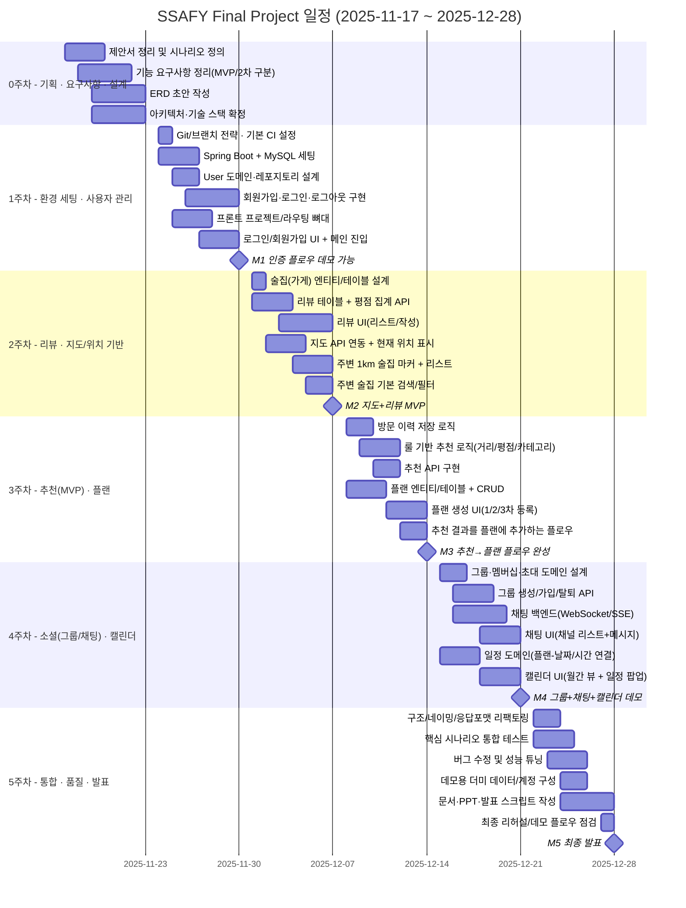

## 1. 전체 타임라인 개요 (주차 단위)

- **0주차 (11/17 ~ 11/23)** : 기획·요구사항 정리, ERD/아키텍처 설계
    
- **1주차 (11/24 ~ 11/30)** : 프로젝트 환경 세팅 + 회원/로그인 플로우
    
- **2주차 (12/01 ~ 12/07)** : 리뷰/평가 기능 + 지도/위치 기반 기능 MVP
    
- **3주차 (12/08 ~ 12/14)** : AI 추천(MVP, 룰 기반) + 술자리 플랜 생성/저장
    
- **4주차 (12/15 ~ 12/21)** : 그룹/채팅 소셜 기능 + 캘린더/일정 UI
    
- **5주차 (12/22 ~ 12/28)** : 통합/버그픽스/성능 + 발표/문서 준비

## WBS
### 0주차 – 기획 · 요구사항 · 설계

|ID|카테고리|작업명|시작일|종료일|비고|
|---|---|---|---|---|---|
|T0-1|기획/분석|제안서 최종 정리, 서비스 컨셉/페르소나/주요 시나리오 정리|2025-11-17|2025-11-20|이미 대부분 진행 중 가정|
|T0-2|요구사항|기능 요구사항(FR) 정리 및 **MVP/2차 기능 구분**|2025-11-18|2025-11-22|우리가 정리한 FR 세트 확정|
|T0-3|설계|ERD 초안 작성(유저, 술집, 리뷰, 플랜, 그룹/채팅 등)|2025-11-19|2025-11-23|DB 테이블 초안|
|T0-4|설계/아키텍처|전체 아키텍처 구조 및 기술 스택 확정 (API/프론트 구조)|2025-11-19|2025-11-23|레이어 구조, 모듈 구분 등|

---

### 1주차 – 기본 환경 세팅 + 사용자 관리(MVP)

|ID|카테고리|작업명|시작일|종료일|비고|
|---|---|---|---|---|---|
|T1-1|인프라/공통|Git 레포/브랜치 전략, 기본 CI(or 단순 빌드 스크립트) 설정|2025-11-24|2025-11-25|main/dev 브랜치 등|
|T1-2|백엔드 환경|Spring Boot 프로젝트 생성, 공통 의존성 세팅, MySQL 연동|2025-11-24|2025-11-27|로컬 DB 연결 테스트|
|T1-3|도메인/인증|User 엔티티/레포지토리/서비스 설계|2025-11-25|2025-11-27|회원 도메인 기본|
|T1-4|인증 기능(MVP)|회원가입/로그인/로그아웃, 세션 또는 JWT 기반 인증 구현|2025-11-26|2025-11-30|Postman으로 검증|
|T1-5|프론트 환경|프론트 프레임워크(React/Vue 등) 프로젝트 생성, 라우팅 뼈대|2025-11-25|2025-11-28|/login, /main 라우트|
|T1-6|UI – 인증 플로우|회원가입/로그인 화면 + 로그인 후 대시보드 기본 레이아웃|2025-11-27|2025-11-30|“로그인 → 메인” 데모 가능|

**마일스톤 M1 (11/30):**

- “회원가입 → 로그인 → 메인 화면 진입” 데모 가능
    

---

### 2주차 – 리뷰/평가 + 지도/위치 기반 기능(MVP)

|ID|카테고리|작업명|시작일|종료일|비고|
|---|---|---|---|---|---|
|T2-1|DB/도메인|술집(가게) 엔티티/테이블 설계 (기본 정보 + 위치 정보)|2025-12-01|2025-12-02|seed 데이터 일부|
|T2-2|리뷰 기능(MVP)|리뷰 테이블, 리뷰 CRUD API, 평균 별점/리뷰 수 집계 API|2025-12-01|2025-12-04|사용자-술집 FK|
|T2-3|리뷰 UI|술집 상세 화면 + 리뷰 리스트 + 리뷰 작성 폼|2025-12-03|2025-12-07|별점 + 텍스트|
|T2-4|지도 연동|Kakao/Naver Map API 연동, 현재 위치 표시|2025-12-02|2025-12-05|API 키 세팅|
|T2-5|주변 술집 표시|현재 위치 기준 주변 술집 마커 표시 + 좌측 리스트(1km 내)|2025-12-04|2025-12-07|위치 기반 리스트|
|T2-6|기본 검색|“내 주변 술집 검색” API + UI (간단 키워드/카테고리 필터)|2025-12-05|2025-12-07|필터 아주 심플하게|

**마일스톤 M2 (12/07):**

- 지도에서 **내 위치 기반 주변 술집** 확인 + **기본 리뷰 작성/조회** 가능
    

---

### 3주차 – AI 추천(MVP 룰 기반) + 술자리 플랜 생성/저장

|ID|카테고리|작업명|시작일|종료일|비고|
|---|---|---|---|---|---|
|T3-1|방문 이력|방문 이력 저장 로직 (플랜 실행 시/리뷰 작성 시 히스토리 기록)|2025-12-08|2025-12-10|심플한 로그 구조|
|T3-2|추천 로직(MVP)|거리 + 평점 + 카테고리 기반의 **룰 기반 추천 엔진** 구현|2025-12-09|2025-12-12|phase(1차/2차) 고려|
|T3-3|추천 API|`GET /recommendations?phase=1|2|3&lat=&lng=` API 구현|2025-12-10|
|T3-4|플랜 도메인|플랜(1차/2차/3차 장소 + 시간) 엔티티/테이블 + CRUD API|2025-12-08|2025-12-11|사용자별 플랜|
|T3-5|플랜 UI|플랜 생성 화면 (1차/2차/3차 등록) + 추천 결과에서 플랜에 추가 UX|2025-12-11|2025-12-14|추천→플랜 연결|
|T3-6|플랜 공유(MVP)|플랜 공유를 위한 간단한 링크 또는 그룹 내 공유 기능 1차 버전|2025-12-12|2025-12-14|풀 소셜 연동 전 단계|

**마일스톤 M3 (12/14):**

- **“내 주변 → 추천 받기 → 1/2/3차 플랜 생성/저장”** end-to-end 플로우 완성
    

---

### 4주차 – 소셜(그룹/채팅) + 일정/캘린더 UI

|ID|카테고리|작업명|시작일|종료일|비고|
|---|---|---|---|---|---|
|T4-1|그룹 도메인|그룹 엔티티, 멤버십(그룹-사용자), 초대 토큰 구조 설계|2025-12-15|2025-12-17|최소 기능만|
|T4-2|그룹 기능(MVP)|그룹 생성/가입/탈퇴, 그룹원 목록 조회 API|2025-12-16|2025-12-19|UI 기본|
|T4-3|채팅 인프라|WebSocket or SSE 기반 채팅 백엔드 구성|2025-12-16|2025-12-20|텍스트만 우선|
|T4-4|채팅 UI|그룹 채팅 화면(채널 리스트 + 메시지 리스트 + 입력창)|2025-12-18|2025-12-21|디스코드 라이트 버전 느낌|
|T4-5|일정/캘린더 도메인|술자리 일정(날짜/시간/플랜 참조) 엔티티 + 기본 CRUD|2025-12-15|2025-12-18|플랜과 연결|
|T4-6|캘린더 UI|월간 캘린더 뷰에서 내 술자리 일정 표시 + 일정 클릭 시 간단 팝업|2025-12-18|2025-12-21|최소 시각화|

**마일스톤 M4 (12/21):**

- **그룹/채팅 기본 + 캘린더에서 술자리 일정 확인** 가능
    

---

### 5주차 – 통합, 버그픽스, 성능, 발표 준비

| ID   | 카테고리    | 작업명                                     | 시작일        | 종료일        | 비고           |
| ---- | ------- | --------------------------------------- | ---------- | ---------- | ------------ |
| T5-1 | 통합/리팩토링 | 모듈 간 의존성/네이밍 정리, 공통 응답 포맷/에러 처리 통일      | 2025-12-22 | 2025-12-24 | 구조 정리        |
| T5-2 | 통합 테스트  | 핵심 시나리오 E2E 테스트 (회원→지도→추천→플랜→공유→채팅→일정)  | 2025-12-22 | 2025-12-25 | 수작업 + 일부 자동화 |
| T5-3 | 버그/성능   | 쿼리 튜닝, N+1, 느린 부분 개선, 크래시/버그 수정         | 2025-12-23 | 2025-12-26 | 우선순위 높은 것부터  |
| T5-4 | 데이터/데모셋 | 데모용 계정/플랜/리뷰/가게 seed 데이터 구성             | 2025-12-24 | 2025-12-26 | 발표용 환경 세팅    |
| T5-5 | 문서/발표준비 | 아키텍처 다이어그램, ERD, 기능 요약, 발표 PPT, 데모 스크립트 | 2025-12-24 | 2025-12-28 | 리허설 포함       |
| T5-6 | 마일스톤 M5 | 최종 리허설 및 시연 흐름 점검                       | 2025-12-27 | 2025-12-28 | 데모 플로우 확정    |
