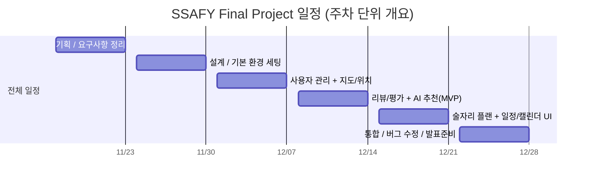

## 1. 전체 타임라인 개요 (주차 단위)

- 0주차 (11/17 ~ 11/23) : 기획·요구사항 정리 (FR/MVP 범위 확정, 아직 개발 X)
- 1주차 (11/24 ~ 11/30) : ERD/아키텍처 설계 + FE/BE/DB 기본 환경 세팅
- 2주차 (12/01 ~ 12/07) : 사용자 관리(회원/인증) + 지도/위치 기반 기능
- 3주차 (12/08 ~ 12/14) : 리뷰/평가 기능 + AI 추천(MVP 룰 기반)
- 4주차 (12/15 ~ 12/21) : 술자리 플랜(코스) + 일정/캘린더 UI
- 5주차 (12/22 ~ 12/28) : 통합/버그픽스/성능 + 문서/발표 준비

## 2. WBS

### 마일스톤 

| 마일스톤 | 주차  | 이름/의미                                     |
| ---- | --- | ----------------------------------------- |
| M0   | 0주차 | 기획·기능 요구사항 정리 완료 (FR · MVP 범위 동결)         |
| M1   | 1주차 | ERD/아키텍처 설계 및 FE/BE/DB 기본 환경 세팅 완료        |
| M2   | 2주차 | 회원가입/로그인 + 지도/현재 위치 + 주변 술집 리스트 동작        |
| M3   | 3주차 | 리뷰 CRUD + 방문 이력 + AI 추천(MVP)까지 E2E 플로우 동작 |
| M4   | 4주차 | 술자리 플랜 CRUD + 캘린더/일정 UI까지 완성              |
| M5   | 5주차 | 통합 테스트/버그픽스/성능 튜닝 + 발표/데모 준비 완료           |
### 0주차 – 기획 · 요구사항 정리

|ID|카테고리|작업명|시작일|종료일|비고|
|---|---|---|---|---|---|
|T0-1|기획/분석|제안서 최종 정리, 서비스 컨셉·페르소나·핵심 시나리오 정리|2025-11-17|2025-11-20|전체 스토리라인, 타깃 유저, 문제 정의 정리|
|T0-2|요구사항|기능 요구사항(FR) 정리 및 MVP / 2차 기능 구분|2025-11-18|2025-11-23|기능 요구사항 문서 + FR MUST/SHOULD 라벨링|

---

### 1주차 – 설계 + 기본 환경 세팅

|ID|카테고리|작업명|시작일|종료일|비고|
|---|---|---|---|---|---|
|T1-1|설계/아키텍처|전체 아키텍처 구조 및 기술 스택 확정 (API/프론트/DB/배포 전략)|2025-11-24|2025-11-25|레이어 구조, 모듈 구분, 빌드/배포 방식 정리|
|T1-2|설계/ERD|ERD 초안 작성(유저, 술집, 리뷰, 방문, 플랜, 일정 등 핵심 도메인)|2025-11-24|2025-11-27|지금 우리가 만든 도메인 ERD 반영|
|T1-3|인프라/공통|Git 레포/브랜치 전략, 기본 CI 또는 빌드 스크립트 설정|2025-11-24|2025-11-26|main/dev 브랜치, GitHub Actions(또는 단순 스크립트)|
|T1-4|백엔드 환경|Spring Boot 프로젝트 생성, 공통 의존성 세팅, MySQL 연동|2025-11-24|2025-11-30|로컬 DB 연결 및 애플리케이션 기동 확인|
|T1-5|DB 환경|초기 스키마 생성용 SQL/마이그레이션 스크립트 템플릿 정리|2025-11-25|2025-11-29|Flyway/Liquibase 또는 수동 SQL 기준|
|T1-6|프론트 환경|프론트 프로젝트 생성, 기본 라우팅(/login, /map, /plan, /calendar 등)|2025-11-25|2025-11-30|라우팅 구조만 우선, 화면은 뼈대 수준|
|T1-7|UI 공통|공통 레이아웃(헤더/네비/컨테이너) 및 기본 색·타이포 스타일 가이드|2025-11-27|2025-11-30|이후 페이지들이 이 레이아웃을 사용하도록 합의|

---

### 2주차 – 사용자 관리 + 지도/위치 기반 기능

|ID|카테고리|작업명|시작일|종료일|비고|
|---|---|---|---|---|---|
|T2-1|도메인/인증|User 엔티티/레포지토리/서비스 설계 & 구현|2025-12-01|2025-12-02|회원 도메인, 비밀번호 해시, 상태(status) 컬럼 포함|
|T2-2|인증 기능(MVP)|회원가입/로그인/로그아웃, 세션 또는 JWT 기반 인증 구현|2025-12-01|2025-12-04|Postman으로 API 검증, 에러 응답 포맷 통일|
|T2-3|UI – 사용자|회원가입/로그인 화면 + 로그인 후 메인/프로필 기본 UI|2025-12-02|2025-12-07|“로그인 → 메인” 흐름 구현|
|T2-4|도메인/DB|술집(Bar) 엔티티/테이블 설계 (기본 정보 + 위치 정보, seed 데이터)|2025-12-01|2025-12-03|위도/경도, 카테고리 FK, 더미 데이터 삽입 스크립트|
|T2-5|지도 연동|Kakao/Naver Map API 연동, 현재 위치 마커 표시|2025-12-02|2025-12-05|API 키 세팅, 기본 중심 좌표·줌 레벨 설정|
|T2-6|주변 술집 표시|현재 위치 기준 주변 술집 마커 + 좌측 리스트(1km 내)|2025-12-04|2025-12-07|Bar DB와 연동, 클릭 시 상세 패널(기본 정보)|
|T2-7|기본 검색|“내 주변 술집 검색” API + UI (간단 키워드/카테고리 필터)|2025-12-05|2025-12-07|카테고리/이름 필터 정도의 심플 버전|

---

### 3주차 – 리뷰/평가 + AI 추천 (MVP)

|ID|카테고리|작업명|시작일|종료일|비고|
|---|---|---|---|---|---|
|T3-1|리뷰 도메인|리뷰 테이블 설계(별점 + 텍스트 + 유저/바/방문 FK) 및 매핑 설정|2025-12-08|2025-12-09|REVIEWS, REVIEW_MEDIA, REVIEW_LIKES 기본 구조 확정|
|T3-2|리뷰 기능(MVP)|리뷰 CRUD API, 평균 별점/리뷰 수 집계 API 구현|2025-12-08|2025-12-11|술집 상세에서 사용될 요약 정보|
|T3-3|리뷰 UI|술집 상세 화면 + 리뷰 리스트 + 리뷰 작성/수정/삭제|2025-12-09|2025-12-12|최신순/평점순 정도의 정렬|
|T3-4|방문 이력|방문 이력 VISITS 저장 로직 (리뷰 작성 시, 플랜 실행 시 기록 기준 마련)|2025-12-08|2025-12-10|누가 언제 어디를 갔는지 로그 형태로 남김|
|T3-5|추천 로직(MVP)|거리 + 평점 + 카테고리 + 사용자 선호 기반 룰 기반 추천 엔진|2025-12-10|2025-12-13|1·2·3차(phase)에 따라 다른 후보 집합/가중치 적용|
|T3-6|추천 API|`GET /recommendations?phase=1|2|3&lat=&lng=` API 구현|2025-12-11|
|T3-7|추천 UI|지도/리스트에서 추천 결과 표시 + “추천만 보기” 토글/필터|2025-12-11|2025-12-14|추천 결과 하이라이트, 기본 UX만|

---

### 4주차 – 술자리 플랜 + 일정/캘린더 UI

(※ 소셜(그룹/채팅) 기능은 제외)

|ID|카테고리|작업명|시작일|종료일|비고|
|---|---|---|---|---|---|
|T4-1|플랜 도메인|플랜(1차/2차/3차 장소 + 시간) 엔티티/테이블 + CRUD API|2025-12-15|2025-12-18|PARTY_PLANS, PARTY_PLAN_STOPS|
|T4-2|플랜 UI|플랜 생성 화면(1/2/3차 등록) + 추천/지도 결과에서 “플랜에 추가” UX|2025-12-17|2025-12-21|추천 결과에서 바로 플랜에 추가하는 흐름|
|T4-3|플랜 공유(간단)|플랜 상세 페이지용 공유 URL(토큰) 생성(그룹/채팅 없이 단순 링크 공유)|2025-12-18|2025-12-21|나중에 소셜 붙일 수 있게 토큰 구조만 미리 정의|
|T4-4|일정/캘린더 도메인|술자리 일정(날짜/시간/플랜 참조) 엔티티 + 기본 CRUD|2025-12-15|2025-12-18|SCHEDULES 테이블, 알림 시각 필드 포함|
|T4-5|캘린더 UI|월간 캘린더 뷰에서 내 술자리 일정 표시 + 일정 클릭 시 간단 팝업|2025-12-18|2025-12-21|일정 상세(플랜/장소/시간)를 모달/사이드 패널로 표시|

---

### 5주차 – 통합 / 버그 수정 / 발표 준비

|ID|카테고리|작업명|시작일|종료일|비고|
|---|---|---|---|---|---|
|T5-1|통합/리팩토링|모듈 간 의존성/네이밍 정리, 공통 응답 포맷·에러 처리·예외 핸들링 정리|2025-12-22|2025-12-24|패키지 구조/DTO/에러코드 통일|
|T5-2|통합 테스트|핵심 시나리오 E2E 테스트 (회원→지도→추천→리뷰→플랜→일정)|2025-12-22|2025-12-25|수동 테스트 케이스 + 필요한 부분만 간단 자동화|
|T5-3|버그/성능|쿼리 튜닝, N+1 문제, 느린 화면/쿼리 개선, 크래시/버그 수정|2025-12-23|2025-12-26|우선순위 높은 버그/UX 이슈부터 처리|
|T5-4|데이터/데모셋|데모용 계정/플랜/리뷰/술집 seed 데이터 구성|2025-12-24|2025-12-26|시연용 “스토리”에 맞춘 더미 데이터|
|T5-5|문서/발표 준비|아키텍처 다이어그램, ERD, 주요 기능 요약, 발표용 PPT, 데모 스크립트 작성|2025-12-24|2025-12-28|화면 캡처, 흐름도, 주요 쿨 포인트 정리|
|T5-6|리허설|최종 리허설 및 시연 흐름 점검|2025-12-27|2025-12-28|발표 시간에 맞춰 “시연 + 설명” 타임라인 연습|