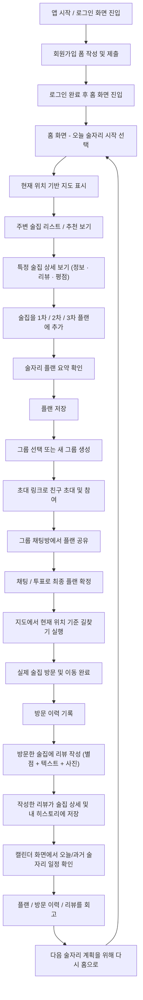

| 단계  | 진입 화면       | 주요 동작                          | 결과              |
| --- | ----------- | ------------------------------ | --------------- |
| 1   | 로그인/회원가입    | 이메일/비번 또는 구글로 로그인              | 사용자 인증 완료       |
| 2   | 홈/지도 메인     | 현재 위치 기반 주변 술집·추천 리스트 확인       | 오늘 술자리 시작 포인트   |
| 3   | 추천/검색 화면    | 추천 술집 + 리뷰·평점 확인, 1/2/3차 장소 선택 | 플랜 구성용 후보 확정    |
| 4   | 플랜 생성 화면    | 1차~3차 장소/시간/메모 입력, 플랜 저장       | 오늘 술자리 플랜 생성    |
| 5   | 그룹/채팅 화면    | 그룹 생성, 초대 URL 공유, 채팅/투표로 의견 조율 | 최종 코스 합의        |
| 6   | 지도/길찾기 화면   | 각 차수 별 술집 위치 확인, 길찾기 실행        | 실제 이동/방문 수행     |
| 7   | 리뷰 작성 화면    | 방문한 술집에 별점+리뷰(텍스트/사진) 작성       | 술집/사용자 히스토리에 기록 |
| 8   | 캘린더/히스토리 화면 | 과거 술자리 일정 및 플랜/리뷰 회고           | 다음 술자리 계획에 참고   |

1. **회원가입 & 로그인**
    
    - 사용자는 이메일/비밀번호 또는 OAuth(구글)로 회원가입/로그인 한다.
        
    - 최초 로그인 시 **기본 프로필 / 선호 술/분위기**를 설정한다. (선택)
        
2. **홈 화면 진입 (오늘 술자리 시작)**
    
    - 홈에서 **현재 위치 기반 지도 + 주변 술집 리스트**를 본다.
        
    - 상단에는 **오늘의 술자리 플랜 / 추천 카드**가 노출된다.
        
    - 사용자는 “**오늘 술자리 플랜 만들기**” 버튼을 눌러 시작한다.
        
3. **술집 추천 & 선택**
    
    - 시스템은 **현재 위치 + 시간 + 선호도**를 기반으로 1차/2차/3차 후보 술집들을 추천한다.
        
    - 사용자는:
        
        - 추천 리스트/지도에서 술집을 살펴보고
            
        - 각 술집의 **평점, 리뷰 수, 리뷰 내용, 영업 여부(열림/닫힘)** 를 확인한 뒤
            
        - 1차 / 2차 / 3차 슬롯에 **장소를 선택**해서 넣는다.
            
4. **술자리 플랜 생성**
    
    - 사용자는 선택한 장소들을 기반으로 **플랜(1차→2차→3차)** 을 생성한다.
        
    - 각 장소에 **예상 시간, 간단 메모(예약 정보, 입장 조건 등)** 를 추가한다.
        
    - 생성된 플랜은 **캘린더 일정 + 플랜 목록**에 저장된다.
        
5. **친구 초대 & 그룹 내 의견 조율**
    
    - 사용자는:
        
        - **그룹(술자리 모임)** 을 만들고
            
        - 초대 URL을 생성해 친구들에게 공유한다.
            
    - 친구들은 초대 URL을 통해:
        
        - 로그인/회원가입 후
            
        - 플랜/그룹에 참여할지 동의하고 입장한다.
            
    - 그룹 채팅방에서:
        
        - 생성된 플랜을 공유하고
            
        - 여러 플랜 중 하나를 선택하기 위해 **투표 기능**을 사용한다.
            
6. **지도/길찾기 & 실제 술자리 진행**
    
    - 확정된 플랜에서 **각 차수의 술집 상세 화면**으로 들어간다.
        
    - 지도에서:
        
        - 현재 위치 기준 해당 술집 위치를 확인하고
            
        - **길찾기(도보/대중교통/차)** 기능으로 이동 경로를 확인한다.
            
    - 실제 방문 시, 시스템은 **방문 이력**으로 기록한다.
        
7. **술자리 후 리뷰 작성 & 기록 관리**
    
    - 술자리가 끝난 후:
        
        - 사용자는 방문한 술집에 대해 **별점 + 리뷰(텍스트/사진)** 를 작성한다.
            
        - 리뷰는 해당 술집 상세 페이지와 내 **리뷰 히스토리**에서 확인할 수 있다.
            
    - 캘린더 화면에서:
        
        - **과거 술자리 일정**을 다시 클릭해
            
        - 당시의 **플랜, 방문한 장소, 리뷰, 같이 간 친구** 정보 등을 회고할 수 있다.
            
8. **다음 술자리에서 재사용/추천**
    
    - 사용자는:
        
        - 과거 플랜을 기반으로 **비슷한 코스를 복제**하거나
            
        - 자주 가는 루트를 기반으로 **AI 추천 코스**를 받을 수 있다.
            
    - 시스템은 **누적된 방문 이력 + 리뷰 + 플랜 사용 패턴**을 이용해  
        점점 더 개인화된 추천을 제공한다.